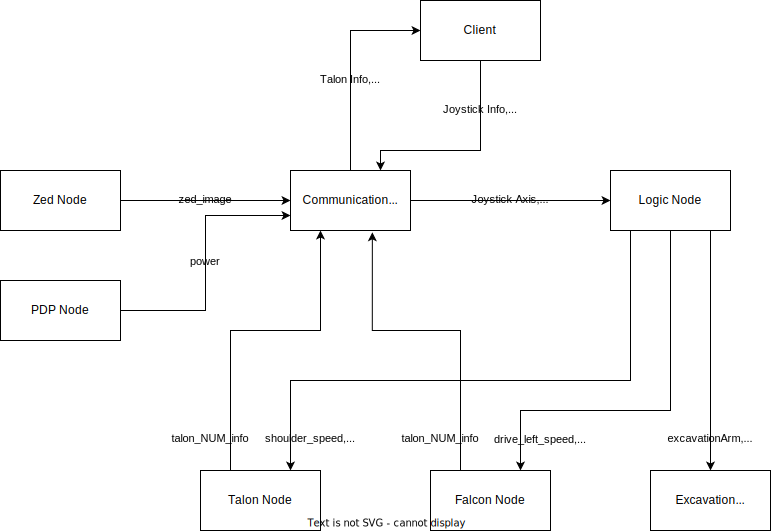

# Welcome to the Razorbotz NASA Robotic Mining Competition Project!
This page intends to provide a starting point and overview of the project, as well as a roadmap for how to get involved with the project even if you aren't familiar with the code or technology stack. Please note that these links may not be up to date and any links should be followed at your own risk.  If you find any links that no longer work or changes that need to be made, please contact me at andrewburroughs17@gmail.com.  Click [here](https://razorbotz.github.io/ROS2/) to view the documentation for the project.  If you are not familiar with Github and the git cli, please refer to the [Razorbotz Github Intro page](https://github.com/Razorbotz/Test).

## Overview
* [Installing ROS2](https://github.com/Razorbotz/ROS2/tree/master#installing-ros2)
* [Understanding the Codebase](https://github.com/Razorbotz/ROS2/tree/master#understanding-the-codebase)
* [Documentation](https://github.com/Razorbotz/ROS2/tree/master#documentation)
* [Tutorials](https://github.com/Razorbotz/ROS2/tree/master#tutorials)
* [Resources](https://github.com/Razorbotz/ROS2/tree/master#resources)

## Installing ROS2
To install ROS2 and begin the project, please refer to the [Razorbotz Installation Page](https://github.com/Razorbotz/ROS2-Installation).  After installing ROS2, please use the following commands to run some examples and ensure ROS2 is installed correctly.

### Run Some Examples
**Run the following commands in one terminal in your Linux environment**

```
source /opt/ros/foxy/setup.bash

ros2 run demo_nodes_cpp talker
```

**In a second terminal in your Linux environment, run the following commands**

```
source /opt/ros/foxy/setup.bash

ros2 run demo_nodes_py listener
```

## Understanding the Codebase
The codebase currently holds the code for both Skinny, the 2021 robot that is used for testing, and Spinner, the 2022 robot that  is currently under development.  Although Skinny is no longer under active development, it is still a good reference and can be used if Spinner is not operational.

### Structure of the packages
ROS2 packages all contain the following:
* src folder //contains the source code / node files
* CMakeLists.txt //Defines dependencies for cmake 
* package.xml //Defines dependencies for ROS2

The src folder within a package contains the .cpp files that define nodes and supporting files for classes/objects/functions relevant to that package.  To read more about ROS2 packages, please refer to the [ROS2 tutorial](https://docs.ros.org/en/foxy/Tutorials/Creating-Your-First-ROS2-Package.html).

The ROS2 packages currently in this project are as follows:
* [Autonomy](https://github.com/Razorbotz/ROS2/tree/master/spinner/src/autonomy)
* [Communication](https://github.com/Razorbotz/ROS2/tree/master/spinner/src/communication2)
* [Excavation](https://github.com/Razorbotz/ROS2/tree/master/spinner/src/excavation)
* [Logic](https://github.com/Razorbotz/ROS2/tree/master/spinner/src/logic)
* [Falcon](https://github.com/Razorbotz/ROS2/tree/master/spinner/src/falcon)
* [Power Distribution Panel](https://github.com/Razorbotz/ROS2/tree/master/spinner/src/power_distribution_panel)
* [Talon](https://github.com/Razorbotz/ROS2/tree/master/spinner/src/talon)
* [Zed Tracking](https://github.com/Razorbotz/ROS2/tree/master/spinner/src/zed)


The Autonomy node is no longer used or under active development.  The functionality of the Autonomy node has been moved to the Logic node.  The 2021-2022 node relationships are shown in the image below.



The Talon and Falcon nodes have been combined into a single instance on the image to reduce the complexity and make it easier to understand.  The message names that are passed from each node are shown.  All motor controller nodes, ie Talon, Falcon, and Exavation nodes, also subscribe to two publishers from the communication node that are called the GO and STOP publishers.  These subscriptions were omitted from the diagram for the sake of clarity.

## Documentation
This project uses [Doxygen](https://www.doxygen.nl/index.html) to generate documentation for the files automatically.  **To make documentation easier for all users, Doxygen is hosted on the Github and does not need to be downloaded by contributers.**  To learn more about the Doxygen formatting, please refer to the [Documenting the code](https://www.doxygen.nl/manual/docblocks.html) section of the Doxygen docs.  The documentation for this project can be found at the project website that is found [here](https://razorbotz.github.io/ROS2/).

### Documentation Template
To standardize the documentation across multiple authors, the following documentation template will be used throughout the project.  To see an example of how files should be commented to generate the documentation correctly, see [Example.cpp](https://github.com/Razorbotz/ROS2/blob/master/docs/Example.cpp).  To view the documentation generated for the Example.cpp file, please click [here](https://razorbotz.github.io/ROS2/Example_8cpp.html).

**Files**
* Description of file
* Topics subscribed to
* Topics published
* Related files

**Functions**
* Description of Function
* Parameters
* Return values
* Related files and/or functions

## Tutorials

To gain a better understanding of ROS2, please refer to the following [tutorials](https://docs.ros.org/en/foxy/Tutorials.html).
* [Configuring Your ROS 2 Environment](https://docs.ros.org/en/foxy/Tutorials/Configuring-ROS2-Environment.html)
* [Understanding ROS 2 Nodes](https://docs.ros.org/en/foxy/Tutorials/Understanding-ROS2-Nodes.html)
* [Understanding ROS 2 Topics](https://docs.ros.org/en/foxy/Tutorials/Topics/Understanding-ROS2-Topics.html)
* [Understanding ROS 2 Parameters](https://docs.ros.org/en/foxy/Tutorials/Parameters/Understanding-ROS2-Parameters.html)
* [Creating a Launch File](https://docs.ros.org/en/foxy/Tutorials/Launch-Files/Creating-Launch-Files.html)
* [Creating a Workspace](https://docs.ros.org/en/foxy/Tutorials/Workspace/Creating-A-Workspace.html)
* [Creating a Package](https://docs.ros.org/en/foxy/Tutorials/Creating-Your-First-ROS2-Package.html)
* [Writing a Simple Publisher and Subscriber (C++)](https://docs.ros.org/en/foxy/Tutorials/Writing-A-Simple-Cpp-Publisher-And-Subscriber.html)
* [Writing a Simple Publisher and Subscriber (Python)](https://docs.ros.org/en/foxy/Tutorials/Writing-A-Simple-Py-Publisher-And-Subscriber.html)
* [Writing Custom ROS2 msg Files](https://docs.ros.org/en/foxy/Tutorials/Beginner-Client-Libraries/Custom-ROS2-Interfaces.html)
* [Using Parameters in a Class (C++)](https://docs.ros.org/en/foxy/Tutorials/Using-Parameters-In-A-Class-CPP.html)
* [Using Parameters in a Class (Python)](https://docs.ros.org/en/foxy/Tutorials/Using-Parameters-In-A-Class-Python.html)
* [Using ROS2 Launch](https://docs.ros.org/en/foxy/Tutorials/Intermediate/Launch/Creating-Launch-Files.html)

## Resources
General Reference Material: 
* [Coding Standards for C++](http://web.mit.edu/6.s096/www/standards.html)

Hardware Documentation:  
* [Talon Documenation](https://store.ctr-electronics.com/content/api/cpp/html/index.html)
* [SparkMax Documenation](https://docs.revrobotics.com/sparkmax/)
* [ODrive Documentation](https://docs.odriverobotics.com/v/latest/index.html)

C++ Reference Material:
* [C++ Namespaces (sets 1 - 3)](https://www.geeksforgeeks.org/namespace-in-c/)
* [C++ Operators reference](https://www.cplusplus.com/doc/tutorial/operators/)
* [C++ Member Access Refresher](https://en.cppreference.com/w/cpp/language/operator_member_access)